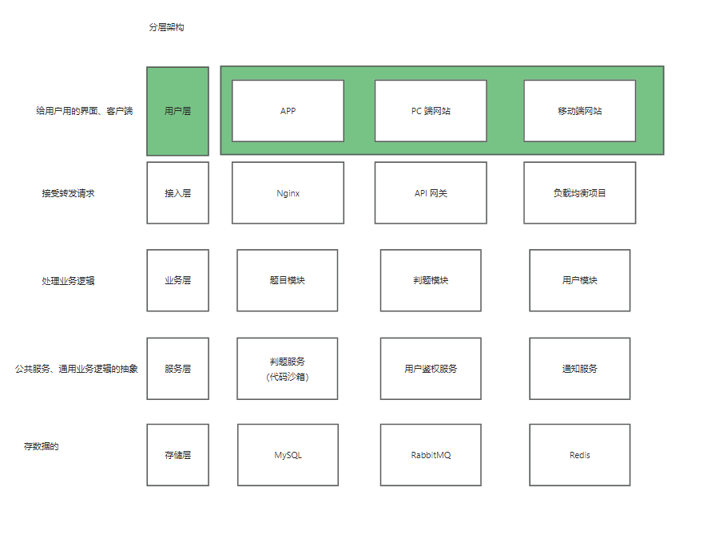
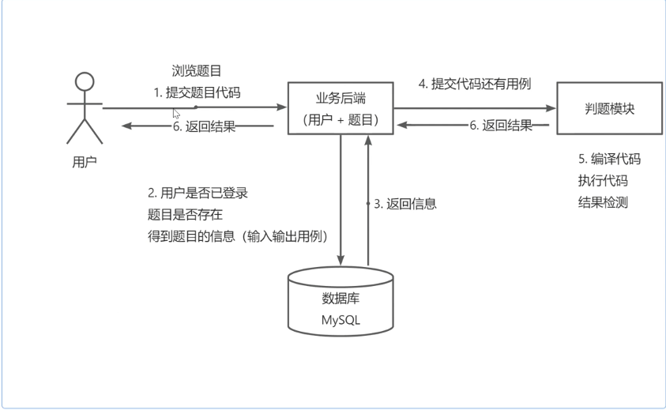
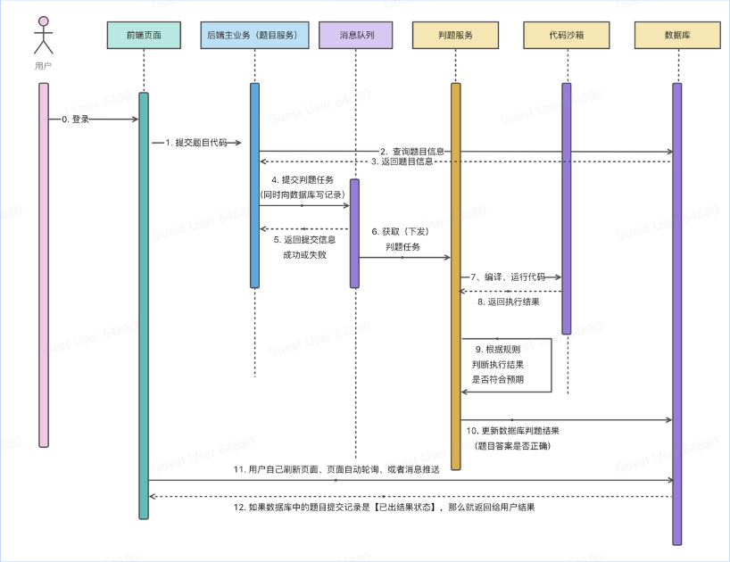
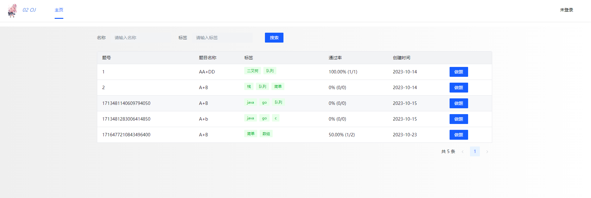
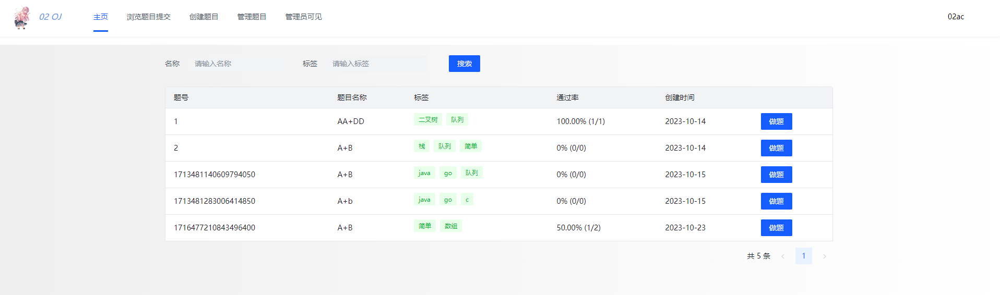
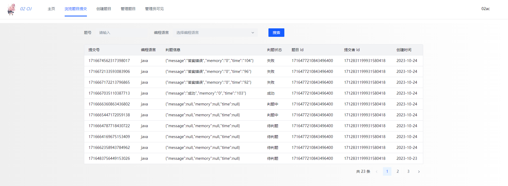
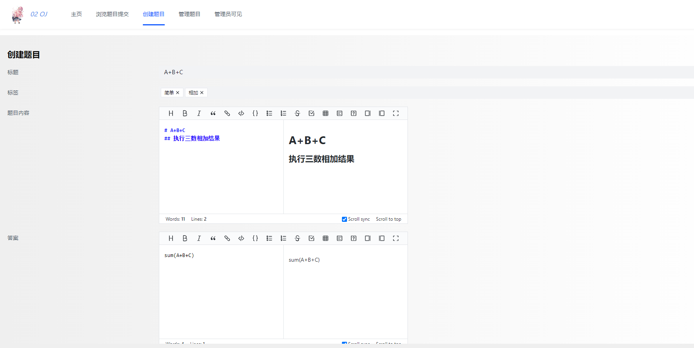
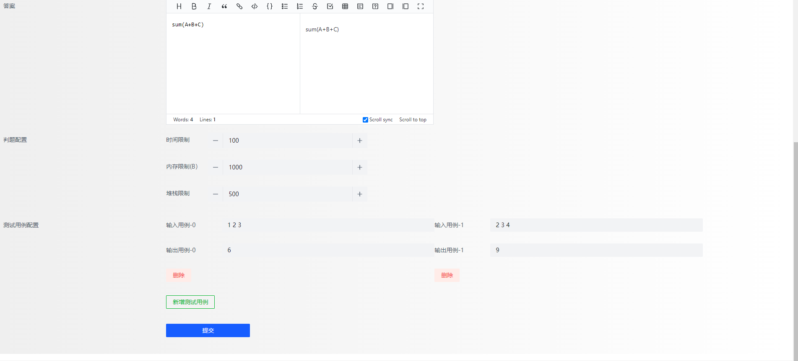
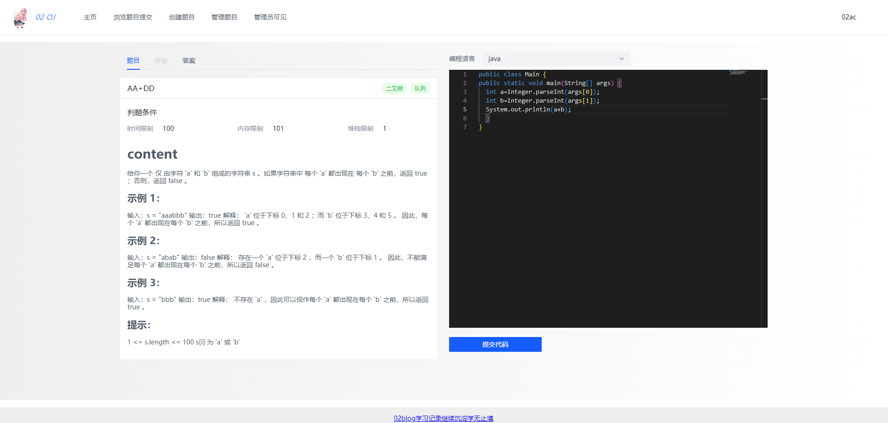
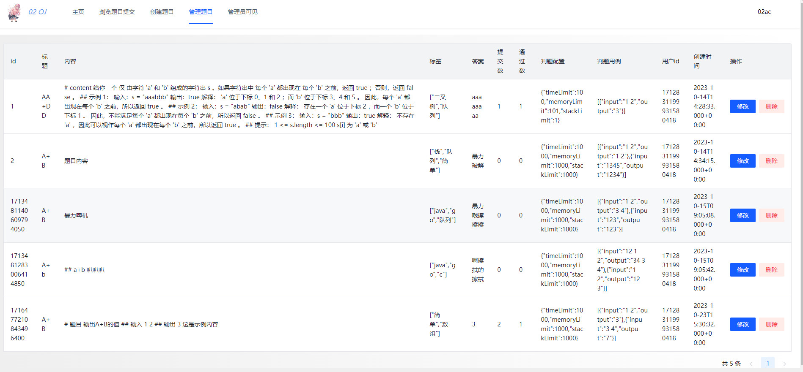

# 02OJ系统-微服务架构
技术栈:
基于Spring Boot + Spring Cloud微服务+Docker (+ Vue 3 + Arco Design)的编程题目在线评测系统。

使用JWT token鉴权进行接口验证,使用gateway网关分发接口,redisSession存储用户登录session信息;使用rabbitMQ消息队列记录需要判题的题目,ack手动确认消息,保证消息可靠性,设置消息自动重连,确保MQ连接稳定

在系统前台，管理员可以创建、管理题目;用户可以自由搜索题目、阅读题目、编写并提交代码。

在系统后端，能够根据管理员设定的题目测试用例在自主实现的代码沙箱中对代码进行编译、运行、判断输出是否正确。
其中，代码沙箱可以作为独立服务，提供给其他开发者使用。

## 架构图

根据业务架构图实现七大模块

```shell
common: 通用工具包模块
gateway: 网关模块:配置路由转发,定义全局响应拦截器 JWT就是在这配置 
judge-service: 判题服务,提交代码进行判断是否正确,调用代码沙箱服务 
model: 实体类,通用返回类 
question-service: 题目服务,显示题目列表信息,管理题目信息CRUD 
user-service: 用户服务,包含普通用户和管理员操作,管理员对用户CRUD 
```
## 接口文档
```shell
localhost:8015/doc.html
```

## 操作流程图

## 执行时序图

简单的执行操作的流程,用户操作写题的一次完整流程

## 部分展示

### 主页


### 登录


### 管理员界面


### 浏览题目提交列表


### 新增题目



### 做题界面


### 管理题目

